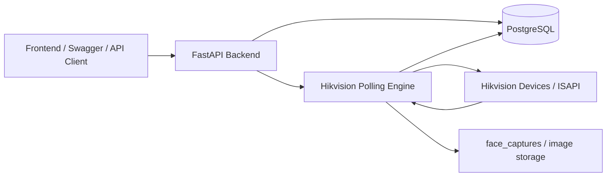
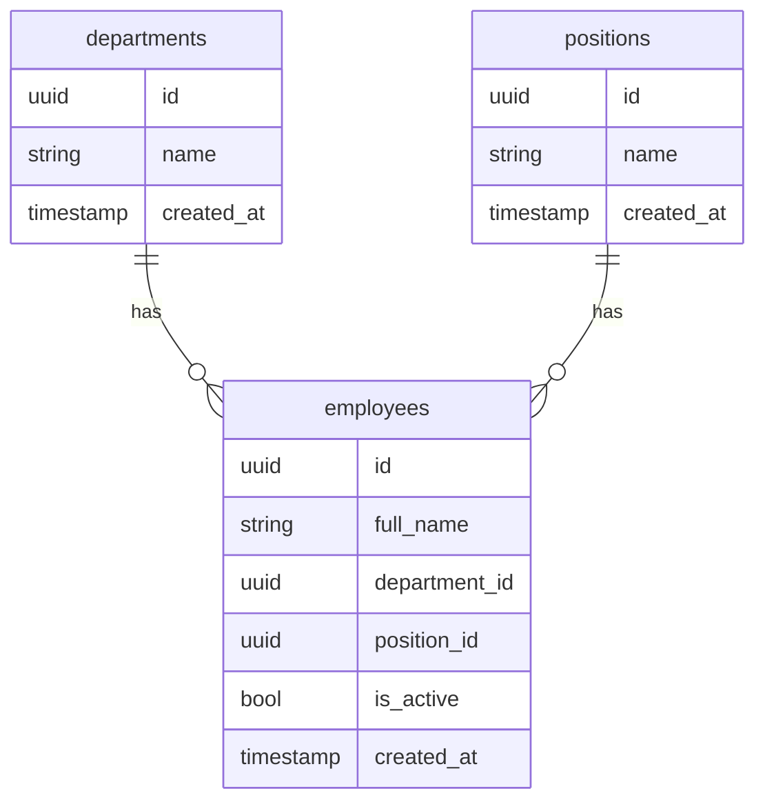
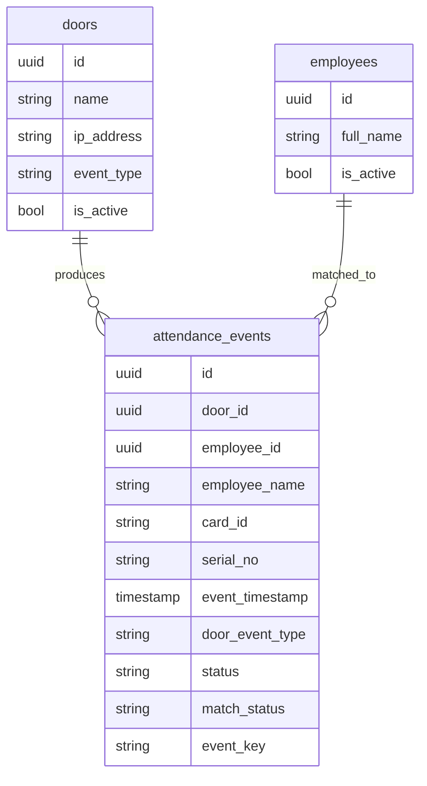
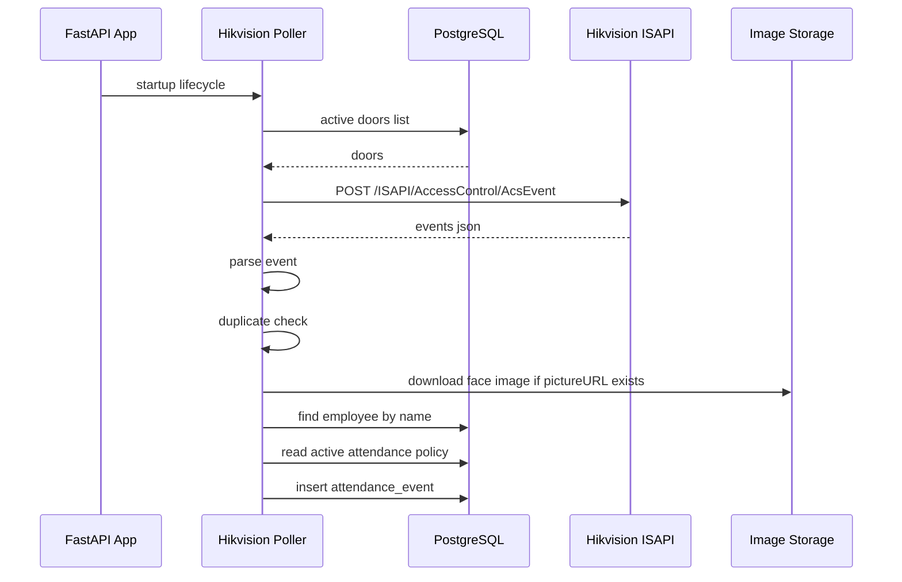

# WORKPLUS Backend Architecture

## Maqsad

WORKPLUS backend HR tizimi uchun admin boshqaruvi, xodimlar moduli, eshiklar moduli va Hikvision ISAPI orqali avtomatik yoqlama yig'ishni bajaradi.

Asosiy vazifalar:

- Admin autentifikatsiya va role-based access control.
- Department, position va employee CRUD.
- Door CRUD: har bir eshik IP va `entry` yoki `exit` tipi bilan saqlanadi.
- Hikvision qurilmalarini doimiy polling qilish.
- Hikvision eventlarni attendance event sifatida bazaga yozish.
- Ish va tushlik vaqti policy asosida `late`, `on_time`, `lunch_out`, `early_exit` kabi statuslarni hisoblash.
- Attendance eventlarni filter, sort, edit va delete qilish.

## High-Level Architecture



## Backend Layerlar

```text
Backend/
  main.py
  api/
    router.py
    routers/
      admins.py
      workforce.py
      attendance.py
  schemas/
    admin.py
    auth.py
    employees.py
    attendance.py
    common.py
  services/
    admins.py
    workforce.py
    device_service.py
    event_service.py
    hikvision_service.py
    image_service.py
  sql/
    employees_module.sql
    attendance_module.sql
  db.py
  utils/
    auth.py
    security.py
```

## Layer Mas'uliyatlari

`main.py`

FastAPI application yaratadi, Swagger sozlamalarini beradi va app lifecycle orqali Hikvision polling engine'ni ishga tushiradi.

`api/routers/*.py`

HTTP endpointlar shu yerda joylashgan. Routerlar request validation, auth dependency, query paramlar, response model va service chaqirish uchun javobgar.

`schemas/*.py`

Pydantic request va response modellari. Swagger documentation ham asosan shu schema'lardan shakllanadi.

`services/*.py`

Business logic va yordamchi funksiyalar. Masalan, event parsing, employee match qilish, attendance status hisoblash, Hikvision polling va rasm yuklash.

`sql/*.sql`

DB table, relation, constraint va index scriptlari.

## Database Architecture

### Admins

`admins` tizim foydalanuvchilari uchun ishlatiladi.

Muhim maydonlar:

- `id`
- `full_name`
- `username`
- `email`
- `password_hash`
- `role`
- `is_active`
- `created_at`

Role access:

- `admin`: barcha admin, workforce va attendance endpointlarga kira oladi.
- `hr`: workforce va attendance modullarini boshqaradi.
- `user`: faqat o'ziga tegishli endpointlar uchun mo'ljallangan.

### Workforce

`departments`

- Bo'limlar ro'yxati.
- Employee shu tablega `department_id` orqali ulanadi.

`positions`

- Lavozimlar ro'yxati.
- Employee shu tablega `position_id` orqali ulanadi.

`employees`

- Xodimlar jadvali.
- `department_id` va `position_id` foreign key orqali bog'langan.
- `is_active=false` xodimni aktiv emasligini bildiradi.

Relation:



### Attendance

`doors`

Eshiklar jadvali. Hikvision qurilmalarining IP manzillari shu yerda saqlanadi.

Muhim maydonlar:

- `id`
- `name`
- `ip_address`
- `event_type`: `entry` yoki `exit`
- `is_active`
- `created_at`

`attendance_policies`

Ish vaqti, chiqish vaqti va tushlik oralig'i shu jadvalda saqlanadi.

Muhim maydonlar:

- `work_start_time`
- `work_end_time`
- `lunch_start_time`
- `lunch_end_time`
- `late_grace_minutes`
- `early_leave_grace_minutes`
- `is_active`

`attendance_events`

Hikvision yoki manual API orqali kelgan yoqlama eventlari shu jadvalga yoziladi.

Muhim maydonlar:

- `door_id`
- `employee_id`
- `employee_name`
- `card_id`
- `serial_no`
- `event_timestamp`
- `door_event_type`
- `status`
- `match_status`
- `picture_path`
- `event_key`
- `raw_payload`

Relation:



## Polling Flow

Polling backend ishga tushganda avtomatik start bo'ladi.



## Hikvision Event Parsing

Hikvision'dan keladigan raw event ichidan quyidagilar olinadi:

- `cardNo` yoki `employeeNoString`: card identifier.
- `name`: employee name.
- `time`: event timestamp.
- `serialNo`: device event serial number.
- `pictureURL`: face image URL.
- `minor`: event type filter uchun ishlatiladi.

Polling faqat kerakli `minor` eventlarni qabul qiladi:

- `1`
- `75`

## Duplicate Prevention

Duplicate oldini olish ikki qatlamda ishlaydi:

`In-memory cache`

Polling engine oxirgi ko'rilgan event keylarni xotirada saqlaydi.

`DB unique constraint`

`attendance_events.event_key` unique. Worker restart bo'lsa ham bir xil event qayta yozilmaydi.

Event key formati:

```text
device_ip + card_id_or_employee_name + timestamp + serial_no
```

## Employee Matching

Hozirgi matching logikasi:

```text
Hikvision event name -> employees.full_name
```

Natijalar:

- Bitta employee topilsa: `match_status = matched`
- Hech kim topilmasa: `match_status = unmatched`
- Bir nechta employee topilsa: `match_status = ambiguous`

`unmatched` va `ambiguous` eventlar yo'qolmaydi. Ular bazada saqlanadi, keyin manual tekshirish yoki edit qilish mumkin.

Production uchun kuchliroq variant:

```text
card_id / employeeNoString -> employee_device_mappings -> employee_id
```

Bu kelajakda qo'shilishi kerak bo'lgan mustahkamroq model.

## Attendance Status Logic

Status `door.event_type`, `attendance_policy` va event vaqtiga qarab belgilanadi.

Entry door:

- Birinchi kirish ish boshlanish va grace limit ichida bo'lsa: `on_time`
- Birinchi kirish kech bo'lsa: `late`
- Tushlikdan qaytish oralig'ida bo'lsa: `lunch_return`
- Kun ichidagi boshqa kirishlar: `entry`

Exit door:

- Tushlik oralig'ida chiqsa: `lunch_out`
- Oxirgi chiqish ish tugash va grace bo'yicha vaqtida bo'lsa: `on_time_exit`
- Oxirgi chiqish erta bo'lsa: `early_exit`
- Oldingi exit eventlar final statusdan `exit` statusga normalizatsiya qilinadi.

Employee topilmasa:

- `unmatched_employee`

Employee nomi bir nechta xodimga mos kelsa:

- `ambiguous_employee`

## API Modules

### Admins

- `POST /admin/login`
- `GET /me`
- `GET /admins`
- `POST /admin/create`
- `PATCH /admin/{admin_id}`
- `DELETE /admin/{admin_id}`

### Workforce

- `POST /departments`
- `GET /departments`
- `GET /departments/{department_id}`
- `PATCH /departments/{department_id}`
- `DELETE /departments/{department_id}`
- `POST /positions`
- `GET /positions`
- `GET /positions/{position_id}`
- `PATCH /positions/{position_id}`
- `DELETE /positions/{position_id}`
- `POST /employees`
- `GET /employees`
- `GET /employees/{employee_id}`
- `PATCH /employees/{employee_id}`
- `DELETE /employees/{employee_id}`

### Attendance

- `POST /doors`
- `GET /doors`
- `GET /doors/{door_id}`
- `PATCH /doors/{door_id}`
- `DELETE /doors/{door_id}`
- `PUT /attendance-policy`
- `GET /attendance-policy`
- `POST /attendance-events`
- `GET /attendance-events`
- `GET /attendance-events/{event_id}`
- `PATCH /attendance-events/{event_id}`
- `DELETE /attendance-events/{event_id}`
- `GET /attendance-poller/status`

## Attendance Query Flow

`GET /attendance-events` kuchli filter va sort uchun ishlatiladi.

Query paramlar:

- `page`
- `limit`
- `employee_id`
- `employee_name`
- `door_id`
- `event_type`
- `status`
- `date_from`
- `date_to`
- `sort`
- `order`

Date format:

```text
DD.MM.YYYY
YYYY-MM-DD
```

Misol:

```http
GET /attendance-events?page=1&limit=50&date_from=01.04.2026&date_to=30.04.2026&employee_name=Ali&sort=event_timestamp&order=desc
```

Bu query April oyidagi attendance eventlarni qaytaradi.

## Face Image Flow

Agar Hikvision event ichida `pictureURL` bo'lsa:

1. URL `@WEB` suffixdan tozalanadi.
2. Digest auth bilan image yuklab olinadi.
3. Fayl `HIKVISION_PICTURES_DIR` ichiga saqlanadi.
4. Saqlangan path `attendance_events.picture_path` maydoniga yoziladi.

## Runtime Config

`.env` orqali boshqariladigan muhim sozlamalar:

```env
DB_HOST=localhost
DB_PORT=5432
DB_NAME=workplus
DB_USER=postgres
DB_PASSWORD=change-me
JWT_SECRET_KEY=change-me
JWT_ALGORITHM=HS256
HIKVISION_POLLING_ENABLED=true
HIKVISION_USERNAME=admin
HIKVISION_PASSWORD=change-me
HIKVISION_POLL_INTERVAL_SECONDS=5
HIKVISION_MAX_RESULTS=10
HIKVISION_PICTURES_DIR=face_captures
HIKVISION_RAW_LOG_FILE=raw_events.jsonl
```

## Security Model

- API endpointlar JWT bearer token bilan himoyalangan.
- Role-based access `require_role` orqali ishlaydi.
- `admin` va `hr` workforce va attendance modullariga kira oladi.
- Hikvision credentiallar kod ichida emas, env orqali beriladi.
- SQL querylarda qiymatlar parametr orqali yuboriladi.
- Sort fieldlar whitelist orqali cheklanadi.

## Current Limitations

- Employee matching hozir `full_name` orqali. Bu real production uchun zaif.
- Polling FastAPI process ichida thread sifatida yuradi. Katta productionda alohida worker service yaxshiroq.
- Manual attendance edit/delete uchun audit log hali yo'q.
- Attendance policy hozir global. Department, branch yoki shift bo'yicha policy hali ajratilmagan.
- Image storage local filesystem. Katta productionda S3 yoki object storage kerak bo'lishi mumkin.

## Recommended Next Architecture Step

Keyingi mustahkamlash bosqichi:

1. `employee_device_mappings` table qo'shish.
2. `card_id` yoki `employeeNoString` orqali employee topish.
3. Manual edit/delete uchun `attendance_event_audit_logs` qo'shish.
4. Polling engine'ni alohida worker servicega ajratish.
5. Attendance report endpointlarini qo'shish: daily summary, monthly summary, late report, early exit report.
